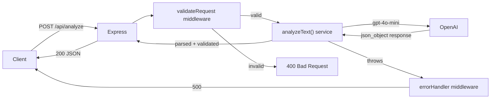
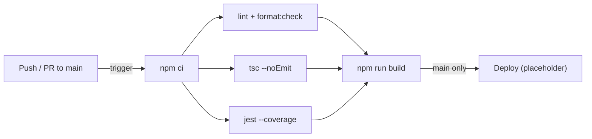

# TribalScale Assessment — Text Analyzer API

A production-minded REST API that accepts a block of text, uses OpenAI's GPT-4o-mini to generate a concise summary and extract 3 key action items, and returns the result as structured JSON.

---

## What I Built

- A single-endpoint REST API: `POST /api/analyze`
- Built with **TypeScript**, **Node.js**, and **Express**
- Integrated with the **OpenAI Chat Completions API** (`gpt-4o-mini`)
- Returns a structured JSON response with a `summary` and an array of 3 `action_items`
- Includes input validation, global error handling, unit tests, and a full GitHub Actions CI/CD pipeline

---

## Architecture

```
Client
  │
  ▼
POST /api/analyze  { "text": "..." }
  │
  ▼
validateRequest middleware  ──► 400 if text is missing, empty, or not a string
  │
  ▼
analyzeText() service
  │
  ├── Truncates input to 12,000 chars (prevents token overflow)
  ├── Sends system prompt + user text to OpenAI gpt-4o-mini
  ├── Uses response_format: json_object (guarantees parseable output)
  └── Validates response shape before returning
  │
  ▼
200 JSON response  { "summary": "...", "action_items": ["...", "...", "..."] }
```



---

## Project Structure

```
tribalscale-assessment/
├── .github/
│   └── workflows/
│       └── ci.yml              # GitHub Actions CI/CD pipeline
├── src/
│   ├── index.ts                # Server entry point
│   ├── app.ts                  # Express app factory (importable in tests)
│   ├── prompts/
│   │   └── analyze.ts          # AI system prompt (imported by service)
│   ├── routes/
│   │   └── analyze.ts          # POST /api/analyze route handler
│   ├── services/
│   │   └── openai.ts           # analyzeText() — all OpenAI logic
│   ├── middleware/
│   │   ├── validateRequest.ts  # Input validation
│   │   └── errorHandler.ts     # Global error handler
│   └── types/
│       └── index.ts            # Shared TypeScript interfaces
├── tests/
│   └── analyze.test.ts         # Jest + Supertest unit tests
├── AGENTS.md                   # Coding standards and AI agent instructions
├── .env.example
├── .eslintrc.json
├── .prettierrc
├── jest.config.ts
├── tsconfig.json
└── package.json
```

**Key design decisions:**

- `app.ts` is a factory function (`createApp()`) rather than a singleton, so it can be imported cleanly in tests without starting a live server.
- `analyzeText()` accepts an optional `OpenAI` client parameter, making it straightforward to inject a mock in tests.
- The service layer has no Express imports. The route layer has no business logic. Concerns are separated.

---

## API Contract

### `POST /api/analyze`

**Request**

```http
POST /api/analyze
Content-Type: application/json

{
  "text": "Your block of text here."
}
```

**Success Response — 200**

```json
{
  "status": 200,
  "summary": "A 2–3 sentence summary of the text.",
  "action_items": [
    "First concrete next step.",
    "Second concrete next step.",
    "Third concrete next step."
  ]
}
```

**Error Responses**

| Status | Body | Cause |
|--------|------|-------|
| `400`  | `{ "status": 400, "error": "..." }` | `text` field is missing, not a string, or empty/whitespace |
| `500`  | `{ "status": 500, "error": "..." }` | OpenAI call failed or returned an unexpected shape |

### `GET /health`

Returns `{ "status": "ok" }` — used by CI and deploy health checks.

---

## Getting Started

### Prerequisites

- An OpenAI API key ([platform.openai.com](https://platform.openai.com))
- Docker 24+ (recommended), **or** Node.js 20+ for local dev

### Quickstart — one command

```bash
git clone https://github.com/ErnestGaisie/tribalscale-text-analyzer.git
cd tribalscale-text-analyzer

# Add your key to .env, then:
./demo.sh
```

`demo.sh` handles everything: starts the server (Docker if available, Node.js otherwise), runs the health check, fires all test cases, and shuts down cleanly.

---

### Option 1 — Docker (recommended, no Node.js required)

```bash
# 1. Clone the repo
git clone <repo-url>
cd tribalscale-assessment

# 2. Set up environment variables
cp .env.example .env
# Edit .env and add your OPENAI_API_KEY

# 3. Build and start
docker compose up --build
```

The server starts at `http://localhost:3000`.

### Run with Docker directly

```bash
docker build -t tribalscale-assessment .
docker run -p 3000:3000 --env-file .env tribalscale-assessment
```

The container exposes port `3000` and includes a health check on `GET /health` (used by Docker Compose to confirm the service is ready).

---

### Option 2 — Local dev (Node.js)

```bash
# 1. Clone the repo
git clone <repo-url>
cd tribalscale-assessment

# 2. Install dependencies
npm install

# 3. Set up environment variables
cp .env.example .env
# Edit .env and add your OPENAI_API_KEY

# 4. Start the dev server (hot-reload)
npm run dev
```

---

### Try It

**Happy path — valid text:**

```bash
curl -X POST http://localhost:3000/api/analyze \
  -H "Content-Type: application/json" \
  -d '{"text": "Our Q3 revenue missed targets by 12%. The sales team needs to improve pipeline quality, marketing should increase lead generation efforts, and leadership must review pricing strategy before Q4."}'
```

**Expected response:**

```json
{
  "status": 200,
  "summary": "Q3 revenue fell short of targets by 12%, indicating issues across sales, marketing, and pricing. Immediate attention is needed to address pipeline quality, lead volume, and competitive pricing ahead of Q4.",
  "action_items": [
    "Improve sales pipeline quality to increase conversion rates.",
    "Scale up marketing efforts to generate a higher volume of qualified leads.",
    "Conduct a leadership review of the pricing strategy before Q4 begins."
  ]
}
```

**Health check:**

```bash
curl http://localhost:3000/health
# → { "status": "ok" }
```

**Error cases — should return 400:**

```bash
# Missing text field
curl -X POST http://localhost:3000/api/analyze \
  -H "Content-Type: application/json" \
  -d '{}'

# Empty string
curl -X POST http://localhost:3000/api/analyze \
  -H "Content-Type: application/json" \
  -d '{"text": ""}'

# Wrong type
curl -X POST http://localhost:3000/api/analyze \
  -H "Content-Type: application/json" \
  -d '{"text": 12345}'
```

---

## The AI Prompt

The system prompt used for every request:

```
You are a helpful assistant that analyzes blocks of text.

Given any text, you will:
1. Write a concise 2-3 sentence summary that captures the main point.
2. Identify exactly 3 key action items — concrete, specific next steps a reader should take.

Always respond with valid JSON in this exact format, and nothing else:
{
  "summary": "string",
  "action_items": ["string", "string", "string"]
}
```

**Why this prompt works:**

- It specifies the output format explicitly in the system prompt, which primes the model to follow it consistently.
- Saying "exactly 3" and "concrete, specific" reduces vague or filler action items.
- Combined with `response_format: { type: "json_object" }` (OpenAI's structured output mode), the model is constrained to return valid JSON — eliminating the markdown code-fence wrapping issue entirely.
- A low `temperature: 0.3` keeps responses focused and deterministic.

---

## What Didn't Work at First / How I Adjusted

- **Markdown-wrapped JSON:** Without `response_format: json_object`, GPT-4o-mini sometimes returns the JSON wrapped in a markdown code fence (` ```json ... ``` `), which breaks `JSON.parse()` silently in some cases. Switching to structured output mode solved this completely.
- **Inconsistent action item counts:** Early prompt drafts without "exactly 3" occasionally returned 2 or 4 items. Adding explicit cardinality to the prompt and adding a post-parse shape validation check (`action_items.length !== 3`) caught this reliably.
- **Token overflow on large inputs:** Passing a very large document caused slow responses and higher costs. Adding a `MAX_INPUT_CHARS = 12000` truncation guard (roughly 3,000 tokens) keeps latency and cost predictable without silently failing.

---

## What I Would Improve With More Time

- **Streaming responses** — use `stream: true` to pipe output to the client in real time for a better UX on long texts.
- **Rate limiting** — add `express-rate-limit` to prevent abuse of the OpenAI key.
- **Authentication** — add API key or JWT middleware so the endpoint isn't publicly open.
- **More test coverage** — test the `analyzeText()` service in isolation with edge cases (empty OpenAI response, malformed JSON despite json_object mode, etc.).
- **Frontend** — a simple React or plain HTML form to make it easy to demo without a curl command.
- **Configurable model** — make the model name an environment variable so it's easy to upgrade to `gpt-4o` without a code change.
- **Observability** — structured logging with `pino` and request tracing.

---

## Coding Standards

| Concern | Standard |
|---------|----------|
| Language | TypeScript with `"strict": true` — no implicit `any` |
| Linting | ESLint + `@typescript-eslint/recommended` |
| Formatting | Prettier (single quotes, trailing commas, 100-char line width) |
| Naming | Files: `camelCase.ts` · Types: `PascalCase` · Functions/vars: `camelCase` |
| Secrets | All loaded from `.env` via `dotenv`, never hardcoded |
| Error handling | All async handlers pass errors to the global `errorHandler` via `next(err)` |
| Architecture | Services have no Express imports. Routes have no business logic. |

---

## CI/CD Pipeline (GitHub Actions)

The pipeline runs on every push and pull request to `main`.



### Stages

| Stage | Command | Notes |
|-------|---------|-------|
| **install** | `npm ci` | Node 20, `node_modules` cached by `package-lock.json` hash |
| **lint** | `npm run lint` + `npm run format:check` | Fails PR if ESLint or Prettier violations exist |
| **typecheck** | `tsc --noEmit` | Fails PR on any TypeScript type error |
| **test** | `npm test -- --ci` | Runs Jest with coverage; report uploaded as artifact |
| **build** | `npm run build` | Compiles TypeScript to `dist/`; only runs after lint, typecheck, and test pass |
| **docker** | `docker build` (no push) | Verifies the image builds cleanly on every PR |
| **deploy** | *(placeholder)* | Runs on `main` push only; pre-configured for Render, Railway, or Fly.io |

The `lint`, `typecheck`, and `test` stages run in **parallel** (all depend on `install` but not on each other), keeping total pipeline time short.

---

## Running Tests Locally

```bash
npm test             # run all tests with coverage
npm run test:watch   # watch mode for development
```

Tests use Jest + Supertest against the Express app with the OpenAI client fully mocked — no API key required to run the test suite.
